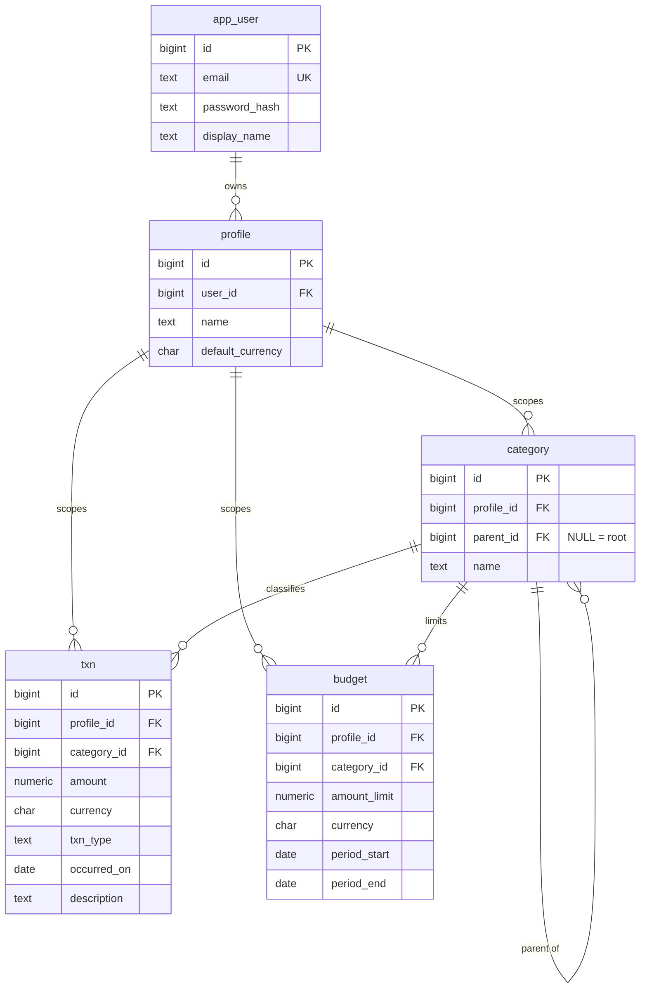

# Database schema

Concrete relational schema for the core entities sketched in
[`ARCHITECTURE.md`](../ARCHITECTURE.md) Section 3.

**Status of this document.** This is the *design* — the reasoning behind the shape
of the data. Once the Flyway migrations exist under
`backend/src/main/resources/db/migration`, those become the source of truth for the
schema as it actually is. This file explains *why* it looks that way, and should be
updated when a decision here changes — not treated as a live mirror of the DDL.

Target: PostgreSQL 16+.

---

## ERD



---

## Conventions

These apply to every table and aren't repeated in the per-entity sections.

| Convention | Choice | Why |
|---|---|---|
| Primary keys | `id BIGINT GENERATED ALWAYS AS IDENTITY PRIMARY KEY` | Small, sequential (good B-tree locality), readable in logs. IDs are enumerable, which is fine because every read is profile-scoped server-side. |
| Timestamps | `created_at`, `updated_at` — `TIMESTAMPTZ NOT NULL DEFAULT now()` | `TIMESTAMPTZ` stores an absolute instant; plain `TIMESTAMP` silently drops the offset. |
| Money | `NUMERIC(19,4)` | Exact decimal. Never `float`/`double` — 0.1 + 0.2 problems in a finance app are unacceptable. 4 decimal places leaves room for currencies with more than 2 minor digits and for future FX rates. |
| Currency | `CHAR(3)` + `CHECK (currency ~ '^[A-Z]{3}$')` | ISO 4217. Fixed width, and the CHECK stops lowercase or garbage codes at the door. |
| Enums | `TEXT` + `CHECK (col IN (...))` | Not a Postgres `ENUM` type: adding a value is an ordinary migration rather than `ALTER TYPE`, and it maps directly onto `@Enumerated(EnumType.STRING)` in JPA. |
| Naming | singular, snake_case | — |

**Two table names are deliberately not the obvious ones.** `user` and `transaction`
are both reserved words in Postgres — usable only if quoted everywhere, forever. The
tables are named **`app_user`** and **`txn`**, and the JPA entities will still be
`User` and `Transaction` via `@Table(name = "app_user")` / `@Table(name = "txn")`.

---

## `app_user`

| Column | Type | Constraints |
|---|---|---|
| `id` | `BIGINT` identity | PK |
| `email` | `TEXT` | NOT NULL, UNIQUE |
| `password_hash` | `TEXT` | NOT NULL |
| `display_name` | `TEXT` | NOT NULL |
| `created_at` | `TIMESTAMPTZ` | NOT NULL DEFAULT `now()` |
| `updated_at` | `TIMESTAMPTZ` | NOT NULL DEFAULT `now()` |

- `email` is stored **lowercased by the service layer**, so the plain `UNIQUE`
  constraint gives case-insensitive uniqueness. The alternative — the `citext`
  extension, or `CREATE UNIQUE INDEX ON app_user (lower(email))` — avoids trusting
  the application to normalize, but adds an extension dependency for one column.
  Revisit if a second write path for users ever appears.
- `password_hash` holds a BCrypt hash (`~60` chars) from Spring Security's
  `PasswordEncoder`. `TEXT` rather than `VARCHAR(60)` so an algorithm change
  (Argon2, longer hashes) isn't a migration.
- No `role` column. There is exactly one kind of user in a self-hosted instance;
  adding roles speculatively would violate the "nothing speculative" rule in
  `CLAUDE.md`.

**Indexes:** the `UNIQUE` constraint on `email` creates the only index needed —
it's the login lookup.

---

## `profile`

| Column | Type | Constraints |
|---|---|---|
| `id` | `BIGINT` identity | PK |
| `user_id` | `BIGINT` | NOT NULL, FK → `app_user(id)` **ON DELETE CASCADE** |
| `name` | `TEXT` | NOT NULL |
| `default_currency` | `CHAR(3)` | NOT NULL, CHECK format |
| `created_at` | `TIMESTAMPTZ` | NOT NULL |
| `updated_at` | `TIMESTAMPTZ` | NOT NULL |

**Constraints**

```sql
UNIQUE (user_id, name)   -- no two profiles named "Personal" under one user
UNIQUE (id, user_id)     -- see note below
```

The second one looks redundant — `id` is already unique on its own, so
`(id, user_id)` cannot possibly collide. It exists purely to be a **valid target for
a composite foreign key**: Postgres requires that the referenced column list of an FK
be backed by a unique constraint. It's what lets other tables say "this row's
`user_id` must match the `user_id` of the profile it points at." The same trick
appears on `category` below, where it does real work.

**Indexes**

| Index | Serves |
|---|---|
| `idx_profile_user_id (user_id)` | "list the profiles for the logged-in user" — the profile switcher |

`default_currency` is the currency new transactions and budgets default to in the UI.
It is **not** a constraint on child rows: per `ARCHITECTURE.md` Section 3, a profile
may legitimately hold transactions in more than one currency, so `txn.currency` is
independent.

---

## `category`

Self-referencing adjacency list. `parent_id IS NULL` means the category is a root.

| Column | Type | Constraints |
|---|---|---|
| `id` | `BIGINT` identity | PK |
| `profile_id` | `BIGINT` | NOT NULL, FK → `profile(id)` **ON DELETE CASCADE** |
| `parent_id` | `BIGINT` | NULL, FK → `category(id)` **ON DELETE RESTRICT** |
| `name` | `TEXT` | NOT NULL |
| `created_at` | `TIMESTAMPTZ` | NOT NULL |
| `updated_at` | `TIMESTAMPTZ` | NOT NULL |

### Constraints

```sql
UNIQUE (id, profile_id)          -- composite-FK target (same trick as profile)
CHECK  (parent_id <> id)         -- a category cannot be its own parent

-- a child must live in the same profile as its parent
FOREIGN KEY (parent_id, profile_id)
    REFERENCES category (id, profile_id) ON DELETE RESTRICT
```

That composite self-FK is the most important line in this file. `CLAUDE.md` and
`ARCHITECTURE.md` both call profile-scoping a real security boundary; this makes it a
**database invariant** rather than a service-layer promise. A category in profile A
physically cannot be parented to a category in profile B, so no bug in the service
layer can produce a tree that spans profiles and leaks one profile's data into
another's rollup.

### Sibling name uniqueness

Two names can't collide under the same parent. This needs **two partial unique
indexes**, not one constraint:

```sql
CREATE UNIQUE INDEX uq_category_sibling_name
    ON category (profile_id, parent_id, name)
    WHERE parent_id IS NOT NULL;

CREATE UNIQUE INDEX uq_category_root_name
    ON category (profile_id, name)
    WHERE parent_id IS NULL;
```

A single `UNIQUE (profile_id, parent_id, name)` would look correct and be quietly
broken. In SQL, `NULL = NULL` is not true, so two root categories both named
"Groceries" (both with `parent_id = NULL`) do **not** count as duplicates and the
constraint would let them through. The `WHERE` clauses split the two cases so roots
are compared on `(profile_id, name)` alone.

### Cycles

`CHECK (parent_id <> id)` blocks the trivial one-node cycle. Longer cycles
(A → B → A) are **not** expressible as a CHECK constraint — a row-level check cannot
walk other rows. They are prevented in the service layer by the same upward traversal
that enforces the depth limit: when reparenting, reject the move if the proposed new
parent is the node itself or any of its descendants.

This matters beyond data tidiness: a cycle would make the recursive CTE below loop
forever.

### Depth limit

Maximum depth is **5 levels** (`Shopping > Stimulants > Vaping > Liquid` is 4).
This is enforced **at the service layer**, on create and on reparent — see
[Depth enforcement](#depth-enforcement) — deliberately not in the database:

- A DB-side check would need a trigger running a recursive query on every insert and
  update, which is a lot of machinery for a product rule.
- The number is a guess that the ticket explicitly flags for revisiting. Changing a
  service constant is cheaper than migrating a trigger.

### Indexes

| Index | Serves |
|---|---|
| `idx_category_profile_id (profile_id)` | "load this profile's category tree" — the picker, and the anchor row of every traversal |
| `idx_category_parent_id (parent_id)` | The recursive term of the downward CTE (`JOIN ... ON c.parent_id = s.id`), and the "does this category have children?" check before a delete |

Without `idx_category_parent_id`, every level of a recursive descent is a sequential
scan — the single index that makes the adjacency list viable.

---

## `txn` (Transaction)

| Column | Type | Constraints |
|---|---|---|
| `id` | `BIGINT` identity | PK |
| `profile_id` | `BIGINT` | NOT NULL, FK → `profile(id)` **ON DELETE CASCADE** |
| `category_id` | `BIGINT` | NOT NULL, FK → `category(id)` **ON DELETE RESTRICT** |
| `amount` | `NUMERIC(19,4)` | NOT NULL, CHECK (`amount > 0`) |
| `currency` | `CHAR(3)` | NOT NULL, CHECK format |
| `txn_type` | `TEXT` | NOT NULL, CHECK IN (`'EXPENSE'`, `'INCOME'`) |
| `occurred_on` | `DATE` | NOT NULL |
| `description` | `TEXT` | NULL |
| `created_at` | `TIMESTAMPTZ` | NOT NULL |
| `updated_at` | `TIMESTAMPTZ` | NOT NULL |

**Constraints**

```sql
CHECK (amount > 0)
CHECK (txn_type IN ('EXPENSE', 'INCOME'))

FOREIGN KEY (category_id, profile_id)
    REFERENCES category (id, profile_id) ON DELETE RESTRICT
```

Same composite-FK guarantee as `category`: a transaction cannot be filed under
another profile's category.

**Why direction is a column, not a sign.** `amount` is always positive and the
direction lives in `txn_type`. A signed single column would be one fewer column, but
then `CHECK (amount > 0)` is impossible, "is this row an expense?" becomes a sign test
scattered through the code, and every aggregate has to remember whether it wants
`SUM`, `SUM(ABS(...))`, or `-SUM(...)`. With an explicit type,
`SUM(amount) WHERE txn_type = 'EXPENSE'` reads exactly as it means.

**Why `occurred_on` is a `DATE`.** Spending is reasoned about per calendar day — "how
much did I spend in March". A `TIMESTAMPTZ` would drag timezone boundaries into every
monthly bucket (a purchase at 23:30 on Jan 31 landing in February for a user one
timezone east). `created_at` still records the actual instant the row was written, so
nothing is lost. `description` is nullable because quick daily entry is a stated
product goal (`README.md`) and forcing a note would slow it down.

### Indexes

| Index | Serves |
|---|---|
| `idx_txn_profile_date (profile_id, occurred_on DESC)` | The workhorse. The transaction list (newest first) and every date-range report. |
| `idx_txn_profile_category_date (profile_id, category_id, occurred_on)` | The per-category rollup the recursive CTE feeds into, and single-category date filters. |

Both lead with `profile_id` because *every* query is profile-scoped — there is no
access path to this table that doesn't filter on it, so it belongs in the leading
position of every composite index.

**Deliberately absent:** a standalone index on `category_id`. For the access patterns
above it would be redundant with `idx_txn_profile_category_date`, and every extra
index is write cost on the most frequently inserted table in the app. Add one only if
a real query appears that filters on category *without* a profile — which, given the
scoping rule, it shouldn't.

---

## `budget`

| Column | Type | Constraints |
|---|---|---|
| `id` | `BIGINT` identity | PK |
| `profile_id` | `BIGINT` | NOT NULL, FK → `profile(id)` **ON DELETE CASCADE** |
| `category_id` | `BIGINT` | NOT NULL, FK → `category(id)` **ON DELETE RESTRICT** |
| `amount_limit` | `NUMERIC(19,4)` | NOT NULL, CHECK (`> 0`) |
| `currency` | `CHAR(3)` | NOT NULL, CHECK format |
| `period_start` | `DATE` | NOT NULL |
| `period_end` | `DATE` | NOT NULL, **inclusive** |
| `created_at` | `TIMESTAMPTZ` | NOT NULL |
| `updated_at` | `TIMESTAMPTZ` | NOT NULL |

**Constraints**

```sql
CHECK  (amount_limit > 0)
CHECK  (period_end >= period_start)
UNIQUE (profile_id, category_id, period_start, period_end)

FOREIGN KEY (category_id, profile_id)
    REFERENCES category (id, profile_id) ON DELETE RESTRICT
```

`period_end` is **inclusive** — a January budget is `2026-01-01 → 2026-01-31`. Stated
explicitly because half-open ranges are the other common convention and mixing them up
is a classic off-by-one. Every range query must therefore use `BETWEEN` /
`<= period_end`, never `< period_end`.

Explicit dates rather than a `period_type` enum (MONTHLY/QUARTERLY) mean any period
shape works — including "the two weeks I'm on holiday" — and range queries are plain
date comparisons instead of interval arithmetic. If recurring budgets are wanted
later, that's a service-layer job that materializes the next row; the schema doesn't
need to change.

### Indexes

| Index | Serves |
|---|---|
| `idx_budget_profile_period (profile_id, period_start, period_end)` | "which budgets are active for this profile today / this month" |

The `UNIQUE` constraint additionally covers lookups by
`(profile_id, category_id, ...)`.

### Known gap: overlapping periods

The `UNIQUE` constraint only stops *identical* periods. A budget for Jan 1–31 and
another for the same category covering Jan 15–Feb 15 are both allowed, and "am I over
budget?" then has two answers.

Postgres can prevent this properly with an exclusion constraint:

```sql
-- requires: CREATE EXTENSION btree_gist;
EXCLUDE USING gist (
    profile_id  WITH =,
    category_id WITH =,
    daterange(period_start, period_end, '[]') WITH &&
)
```

Left out for now — it pulls in an extension and a Postgres-specific feature for a
scenario a single self-hosting user is unlikely to hit by accident, and the UI won't
offer arbitrary custom ranges initially. Recorded here so it's a decision rather than
an oversight; add it the moment custom period ranges become a real feature.

---

## Foreign keys and cascade behavior

| From | To | On delete | Why |
|---|---|---|---|
| `profile.user_id` | `app_user.id` | **CASCADE** | Deleting an account must actually delete its data. |
| `category.profile_id` | `profile.id` | **CASCADE** | A profile owns its categories; deleting the profile removes them. |
| `category.(parent_id, profile_id)` | `category.(id, profile_id)` | **RESTRICT** | Deleting a parent must not silently orphan or destroy a whole subtree. Delete children first, or move them. |
| `txn.profile_id` | `profile.id` | **CASCADE** | Same ownership chain. |
| `txn.(category_id, profile_id)` | `category.(id, profile_id)` | **RESTRICT** | Financial history is never destroyed as a side effect of tidying up categories. |
| `budget.profile_id` | `profile.id` | **CASCADE** | Same ownership chain. |
| `budget.(category_id, profile_id)` | `category.(id, profile_id)` | **RESTRICT** | Same. |

The rule in one line: **cascade ownership, restrict references.**

Deleting down the ownership chain (user → profile → everything) is the user
deliberately discarding their own data, so it cascades. Deleting something other rows
merely *point at* (a category) fails loudly instead. The service layer turns that
failure into a usable flow — reassign the affected transactions and budgets to another
category, then delete — rather than letting a category cleanup quietly take a year of
spending history with it.

Note that the CASCADE from `profile` to `category` and the RESTRICT between categories
coexist without conflict: deleting a profile cascades to *all* its category rows in one
statement, so there's no intermediate state where a parent is gone and a child remains.

---

## Hierarchy queries (recursive CTEs)

The adjacency list keeps writes trivial — creating a category is one insert, moving a
subtree is one `UPDATE ... SET parent_id = ?` regardless of how big the subtree is.
The cost is that reading a whole subtree takes a recursive query.

Both queries below are **native SQL** (`@Query(nativeQuery = true)`), because JPQL has
no `WITH RECURSIVE`. This is the one place the project accepts Postgres-specific SQL,
and it's the direct, accepted price of choosing an adjacency list over a closure table.

### 1. Descendant spend rollup

"Total spend under `Shopping`, including everything nested beneath it, between two
dates."

```sql
WITH RECURSIVE subtree AS (
    SELECT id
      FROM category
     WHERE id = :categoryId
       AND profile_id = :profileId
    UNION ALL
    SELECT c.id
      FROM category c
      JOIN subtree s ON c.parent_id = s.id
     WHERE c.profile_id = :profileId
)
SELECT COALESCE(SUM(t.amount), 0)
  FROM txn t
 WHERE t.profile_id = :profileId
   AND t.category_id IN (SELECT id FROM subtree)
   AND t.txn_type = 'EXPENSE'
   AND t.occurred_on BETWEEN :fromDate AND :toDate;
```

- The first `SELECT` is the **anchor** (the starting node); everything after
  `UNION ALL` is the **recursive term**, re-run against the rows the previous
  iteration produced until it yields nothing.
- `UNION ALL`, not `UNION`: a tree can't produce duplicate ids, so deduplication would
  be a pointless sort on every iteration. (It would also mask a cycle rather than
  hanging on it — but relying on that is not a cycle-prevention strategy.)
- `profile_id` is filtered in **both** the anchor and the recursive term. The composite
  FK already guarantees a subtree can't cross profiles, so this is belt-and-braces on a
  security boundary — and it keeps the query correct in isolation, which matters
  because this is hand-written SQL that bypasses JPA's usual guardrails.
- `COALESCE(..., 0)` so a category with no transactions returns `0` rather than `NULL`.
- The rollup deliberately returns a single `SUM` per currency-agnostic call. Since a
  profile may hold multiple currencies, the service layer either passes a currency
  filter or groups by `t.currency` — mixing currencies into one total would be wrong.
  Adding `GROUP BY t.currency` is the honest default for reporting.

### 2. Ancestor chain (depth of a node)

Walks *upward* from a node to its root. Used to compute depth before allowing a create
or a reparent.

```sql
WITH RECURSIVE ancestors AS (
    SELECT id, parent_id, 1 AS depth
      FROM category
     WHERE id = :categoryId
       AND profile_id = :profileId
    UNION ALL
    SELECT c.id, c.parent_id, a.depth + 1
      FROM category c
      JOIN ancestors a ON c.id = a.parent_id
     WHERE c.profile_id = :profileId
)
SELECT MAX(depth) FROM ancestors;
```

Same structure, opposite direction: the join condition is `c.id = a.parent_id` instead
of `c.parent_id = a.id`. A root category returns `1`.

### 3. Subtree height

Needed for the move case below — how many levels deep the subtree being moved is.

```sql
WITH RECURSIVE subtree AS (
    SELECT id, 1 AS depth
      FROM category
     WHERE id = :categoryId
       AND profile_id = :profileId
    UNION ALL
    SELECT c.id, s.depth + 1
      FROM category c
      JOIN subtree s ON c.parent_id = s.id
     WHERE c.profile_id = :profileId
)
SELECT MAX(depth) FROM subtree;
```

A leaf returns `1`.

### Depth enforcement

`MAX_DEPTH = 5`, checked in the service layer:

**On create** — a new category under `parent`:

```
depth(parent) + 1 <= 5
```

(A new root is depth 1 and always allowed.)

**On reparent** — moving a subtree under `newParent`:

```
depth(newParent) + height(movedSubtree) <= 5
```

The ticket calls this out specifically and it's the case that's easy to get wrong:
checking only the node being moved is not enough. Moving a 3-level subtree under a
level-2 parent puts the moved node at level 3 — fine on its own — but its deepest
descendant lands at level 5... and a 3-level subtree under a *level-3* parent puts
that descendant at level 6, which must be rejected even though the moved node itself
would sit at a legal level 4.

The move must additionally reject `newParent` being the moved node itself or any node
in its own subtree — otherwise the tree develops a cycle and every recursive query
above runs forever. Query 3 already returns exactly that subtree, so the same result
answers both checks.

Both rules are pure logic with clear pass/fail cases, so per `CLAUDE.md` they're
written test-first in the service-layer ticket.

---

## Deliberately deferred

Recorded so each is a decision with a trigger, not an omission:

| Deferred | Add it when |
|---|---|
| Exclusion constraint preventing overlapping budget periods | Custom (non-calendar-aligned) budget ranges become a real feature. |
| `citext` or a `lower(email)` unique index | A second write path for users appears and normalizing in one service method stops being trustworthy. |
| Soft delete / `archived_at` on `category` | Users complain that RESTRICT makes tidying up categories too painful. |
| Closure table or materialized path for the hierarchy | Reparenting or deep aggregation becomes hot enough to measure — the whole point of the adjacency list is that this is unlikely at one-user scale. |
| FX rate table / normalized reporting currency | Cross-currency totals are needed. `ARCHITECTURE.md` Section 3 puts conversion in the service layer, so this may never touch the schema. |
| Attachments, recurring transactions, tags | Actually requested. Not before. |
